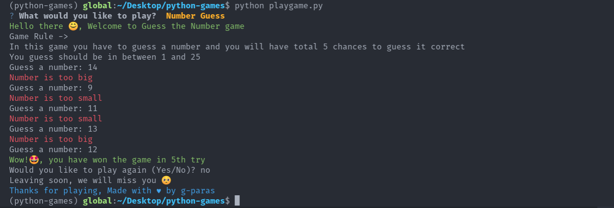

# Command Line Interface Python Games

Collection of some starter python game projects for beginners

### How to play these games

1. Clone this repository

```bash
git clone https://github.com/g-paras/python-games.git
cd python-games
```

2. Install requirements

```bash
pip install -r requirements.txt
```

3. Start Game

```bash
python3 playgame.py
```

### Games avaliable:
  
- Dragon Realm - Stay clear of the Greedy and Hungry Dragon

- Rock Paper Scissor - Choose an option to defeat you opponent

- Number Guess - Guess a number between 1 and 25

- Tic Tac Toe - Defeat you opponent with O and X

- Hangman - Guess the word before time runs out

- Minesweeper - Find the Mines

### Sample play of Number Guess game



## About this repository

There are a total of 5 games in this repository, all of them are beginner lever that will help you practice your python basics like `loops`, `if-else`, `function`, `recursion`, `list comprehension`, `random module`, `time module`, and much more.

#### Two additional modules are also used in this.

- `tinge` : for printing colored text in console
- `pyfiglet` : for ascii-art
- `PyInquirer` : interactive command line interface

#### Dependencies

```
Package        Version
-------------- ---------
pip            21.0.1
prompt-toolkit 1.0.14
pyfiglet       0.8.post1
Pygments       2.9.0
PyInquirer     1.0.3
regex          2021.4.4
setuptools     56.0.0
six            1.16.0
tinge          0.0.2
wcwidth        0.2.5
wheel          0.36.2
```

## Contributors

<a href="https://github.com/g-paras"></a>
<a href="https://github.com/PrernaPandeykp"></a>
<a href="https://github.com/twozero88"></a>
<a href="https://github.com/Arsh069"></a>
<a href="https://github.com/knagar06"></a>
<a href="https://github.com/gsanchit01"></a>
<a href="https://github.com/insaneprasun251"></a>
<a href="https://github.com/herepete"></a>
