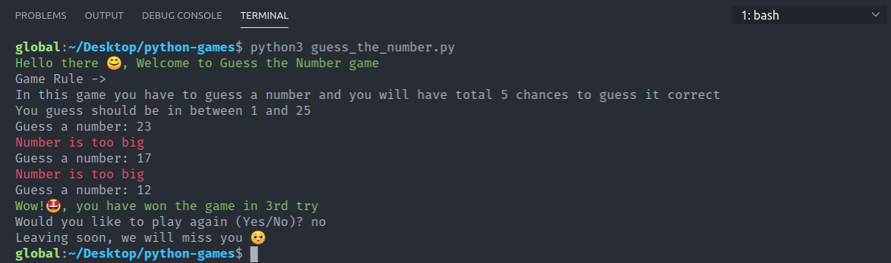

## Command Line Interface Python Games

Collection of some starter python game projects

### How to play these games

1. Clone this repository

```bash
git clone https://github.com/g-paras/python-games.git
cd python-games
```

2. Install requirements

```bash
pip install -r requirements.txt
```

3. Start Game

```bash
python3 guess_the_number.py
```

or

```bash
python3 tictactoe.py
```

or

```bash
python3 RockPaperScissor.py
```

### Sample play of Number Guess game



## About this repository

There are a total of 5 games in this repository, all of them are beginner lever that will help you practice your python basics like `loops`, `if-else`, `function`, `recursion`, `list comprehension`, `random module`, `time module`, and much more.

Two additional modules are also used in this.

- `termcolor` - for printing colored text in console
- `pyfiglet` - for ascii-art
