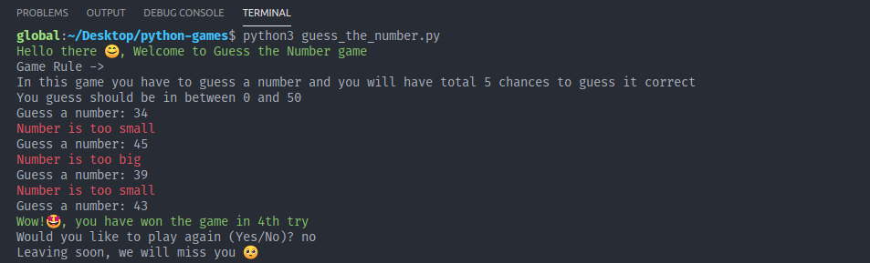

## Command Line Interface Python Games

Collection of some starter python game projects

### How to play these games

1. Clone this repository

```bash
$ git clone https://github.com/g-paras/python-games.git
```

2. Start Game

```bash
$ python3 guess_the_number.py
```


